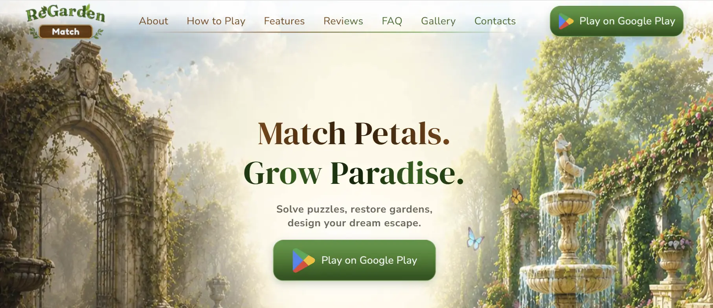

# ReGarden Match



## Про проєкт

**ReGarden Match** — комерційний адаптивний лендинг для мобільної гри, яка поєднує механіку Match-3 із відновленням і персоналізацією саду.

Сайт знайомить користувачів з ігровим процесом, основними можливостями гри, відгуками та галереєю, а також спрямовує їх на сторінку застосунку в Google Play.

[Переглянути сайт](https://tarasbilyi.github.io/STPP-397/) · [Google Play](https://play.google.com/store/apps/details?id=com.yfactorysoft.GardenMatch.gp&hl=en&gl=us) · [Оригінальний командний репозиторій](https://github.com/TarasBilyi/STPP-397)

## Основні можливості

- адаптивний дизайн для мобільних і десктопних пристроїв;
- презентація концепції та ключових механік гри;
- покроковий опис ігрового процесу;
- інтерактивні слайдери можливостей гри та галереї;
- блоки відгуків гравців і поширених запитань;
- анімації появи контенту під час прокручування;
- навігація за секціями та мобільне меню;
- інтеграція з Google Play;
- сторінки Privacy Policy і Terms of Service;
- оптимізовані та адаптивні зображення.

## Команда та формат роботи

Це комерційний проєкт, створений командою з трьох спеціалістів:

- двох розробників;
- UI/UX-дизайнера.

Робота включала розподіл відповідальності між розробниками, реалізацію інтерфейсу за дизайн-макетами, інтеграцію окремих секцій і фінальне адаптивне доопрацювання сайту.

## Моя роль і внесок

У проєкті я працювала як **Frontend Developer**.

Мій технічний внесок:

- розробила секцію **Features** із картками можливостей гри;
- реалізувала секцію **Reviews** із відгуками гравців;
- створила секцію **FAQ**;
- розробила секцію **How to Play** із покроковим описом ігрового процесу;
- реалізувала адаптивну **Gallery**;
- створила та стилізувала **Footer**;
- налаштувала Swiper-слайдери для секцій Features і Gallery;
- додала автоматичне перемикання слайдів і пагінацію;
- інтегрувала адаптивні зображення та ліниве завантаження;
- виконала фінальні стилістичні й адаптивні правки в декількох секціях.

## Технології


## Запуск локально

```bash
git clone https://github.com/Anastasiia-Kosh/ReGarden.git
cd ReGarden
npm install
npm run dev
```

Після запуску відкрийте адресу, вказану Vite у терміналі.

## Командна розробка

Проєкт виконано в межах комерційної командної співпраці. Повна історія розробки та внесків учасників доступна в [оригінальному репозиторії](https://github.com/TarasBilyi/STPP-397).
